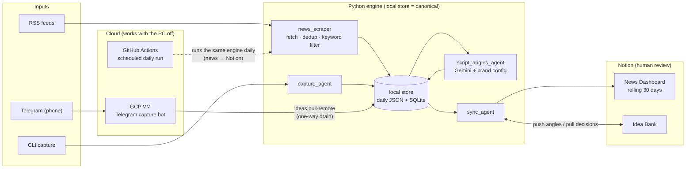

# ContentCreation-OS

**Brand Co-Pilot & Second Brain** — a local-first, modular, human-in-the-loop Python system that curates the day's news, captures raw ideas from anywhere, and turns the right ones into on-brand content angles. **AI curates — the human decides.**

Every morning the news is waiting in Notion (PC off, a GitHub Action did it). Any thought — typed on the PC or sent to a Telegram bot from the phone — becomes a captured idea, gets scored against a personal brand definition, and shows up in a Notion Idea Bank with 2–3 suggested script angles and an advisory brand-fit %. The human Status field is the only gate: the AI never approves, publishes, or decides.

<!-- demo: GIF of Telegram capture → angles → Notion Idea Bank (coming) -->

---

## How it works



1. **Awareness** — `news_scraper` pulls RSS feeds, dedupes by URL, filters noise with keyword rules (no LLM needed), and writes a daily digest. A scheduled GitHub Action syncs it to a Notion News Dashboard that keeps a rolling 30-day window.
2. **Capture** — ideas enter through three doors: CLI one-shot, CLI quick-capture, or a Telegram bot running on a GCP VM (so the phone works with the PC off). Everything lands in one canonical local SQLite DB.
3. **Angles** — `script_angles_agent` reads `config/personal_brand.md` and asks Gemini for 2–3 short-form content angles per idea, plus an advisory brand-fit score.
4. **Review** — `sync_agent` pushes ideas to a Notion Idea Bank and pulls the human's Approve/Reject decisions back into the local store.
5. **Orchestrate** — every module is an idempotent `run(ctx) -> RunResult` step in a registry; `orchestrator.py` chains them: `--steps news,sync` or `--steps angles,ideas-push,ideas-pull`.

The same engine runs in three places: **your machine** (the canonical store), a **GitHub Action** (the daily news run, so the dashboard is fresh with the PC off), and a small **GCP VM** hosting the Telegram bot — whose captures drain one-way into the local DB via `ideas pull-remote`. The full system design (module inventory, schemas, layering rules) lives in [docs/ARCHITECTURE.md](docs/ARCHITECTURE.md).

---

## Design principles

- **Human-in-the-loop** — AI scores, tags, and suggests; it never auto-publishes or auto-approves. Brand fit % is advisory; the human Status in Notion is the only gate.
- **Local-first** — the local store (SQLite/JSON) is canonical; Notion is a review dashboard, never the source of truth.
- **Modular (blackboard pattern)** — modules never import each other; they hand off through shared storage keyed on `processing.status` (`captured → angled → synced`).
- **Progressive complexity** — JSON before SQLite, keyword rules before LLM, one module at a time. The stack upgrades when a phase actually needs it: SQLite arrived when ideas needed persistence, the LLM when scoring needed judgment. Heavier tooling (Docker, vector store, agent frameworks) joins the same way — when a phase earns it, not before.
- **Bring your own brand** — the engine is generic; the voice comes from `config/personal_brand.md` (gitignored). Copy the committed template and the same system runs on *your* brand.

---

## Quick start

Prerequisites: Python 3.11+, a [Notion integration token](https://www.notion.so/my-integrations), a Gemini API key.

```powershell
git clone https://github.com/CynthiaSalazarB/ContentCreation-OS.git
cd ContentCreation-OS
python -m venv .venv
.venv\Scripts\Activate.ps1
pip install -e ".[dev]"

# Configure
copy .env.example .env                                        # fill in your keys
copy config\personal_brand.example.md config\personal_brand.md   # fill in your brand

# Verify
pytest
```

Try it without any keys — the scraper is deterministic and local:

```powershell
python -m agents.news_scraper.run          # → data/news/YYYY-MM-DD.json
python -m agents.news_scraper.view         # → data/news/digest.html
```

With `.env` filled in, run the content pipeline:

```powershell
python -m agents.capture_agent.run process "Docker boundaries finally clicked for me"
python orchestrator.py --steps angles,ideas-push,ideas-pull
```

Day-to-day operation (which command, when, and what runs automatically): **[docs/RUNBOOK.md](docs/RUNBOOK.md)**.

---

## Project structure

```
ContentCreation-OS/
├── orchestrator.py              # step registry: news, sync, angles, ideas-push, ideas-pull
├── pipelines/                   # cross-module composition (capture → angles → Notion)
├── agents/
│   ├── news_scraper/            # deterministic pipeline (no LLM)
│   ├── sync_agent/              # Notion push/pull + retention
│   ├── capture_agent/           # CLI + Telegram bot entry points
│   └── script_angles_agent/     # Gemini + brand config → angles
├── core/                        # shared foundation (never imports agents)
│   ├── models/                  # Pydantic v2 entities (NewsItem, Idea, RunContext)
│   ├── storage/                 # SQLite (ideas) + JSON (daily news)
│   └── llm/                     # Gemini client + routing
├── config/
│   ├── news_sources.yaml        # feeds + keyword filters
│   ├── llm_routing.yaml         # which model for which task
│   ├── personal_brand.example.md  # template — copy to personal_brand.md (gitignored)
│   └── personal_brand.md        # your brand definition (local only)
├── docs/                        # VISION · ARCHITECTURE · RUNBOOK · WHATS-NEXT
├── tests/
└── data/                        # gitignored — your news + ideas stay local
```

Scrapers (deterministic, no LLM) vs. agents (LLM/decision logic) is a deliberate naming distinction. Layering is enforced: `core/` imports nothing above it, modules only import `core/`, and only `pipelines/` + `orchestrator.py` may compose multiple agents.

---

## Build phases

| Phase | Focus | Status |
|-------|-------|--------|
| 0 | News scraper (RSS, dedup, keyword filter) | ✅ |
| 1 | Notion News Dashboard + daily GitHub Action | ✅ |
| 2a | Brand config + Gemini script angles + CLI capture | ✅ |
| 2b | Notion Idea Bank + advisory brand fit % | ✅ |
| 2c | Telegram capture from phone (bot on GCP VM) | ✅ |
| 3 | Knowledge & memory layer — notes ingestion, market/trend research, connection-finder | 🔄 in design |

> Phases 0–2c are built and run daily. Phase 3+ items are candidates under evaluation, not commitments — current thinking in [docs/WHATS-NEXT.md](docs/WHATS-NEXT.md).

---

## Documentation

| Document | Description |
|----------|-------------|
| [docs/VISION.md](docs/VISION.md) | What & why — principles, non-goals |
| [docs/ARCHITECTURE.md](docs/ARCHITECTURE.md) | How — full system design, schemas, module contract |
| [docs/RUNBOOK.md](docs/RUNBOOK.md) | **Which command, when** — day-to-day operation |
| [docs/WHATS-NEXT.md](docs/WHATS-NEXT.md) | Where it's going next |
| [CLAUDE.md](CLAUDE.md) | AI-assisted development guide (Claude Code + per-module skills in `.claude/skills/`) |

---

## Tech stack

Python 3.11+ · Pydantic v2 · feedparser · SQLite · YAML config · Gemini (`google-genai`) · Notion API · Telegram Bot API · GitHub Actions · GCP VM (capture bot) · Claude Code Skills · Notion MCP (development only)

---

## License

[MIT](LICENSE)
