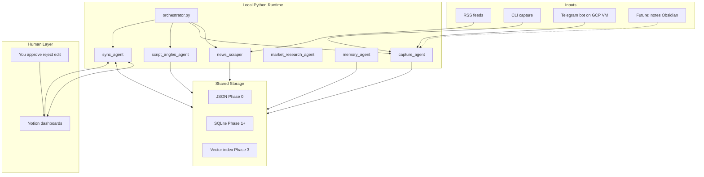
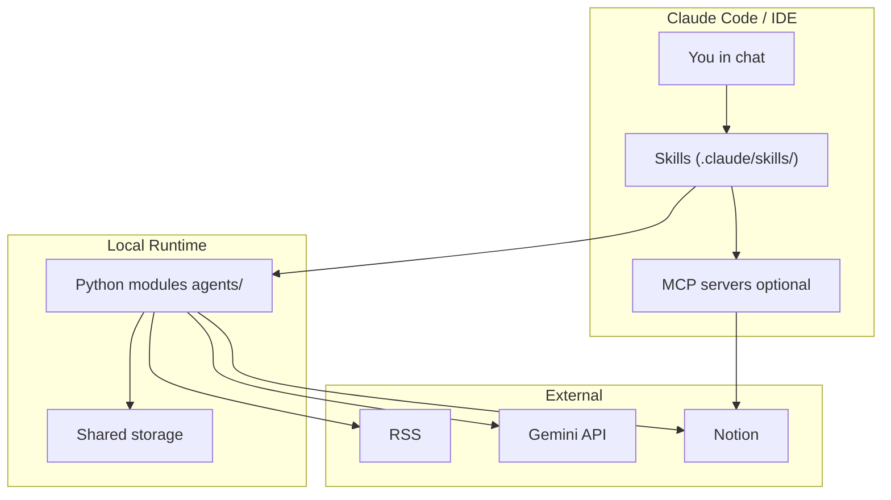

# Idea Angles Pipeline — System Architecture

A local, modular, human-in-the-loop pipeline that turns captured ideas into on-brand script angles, with a filtered daily news feed alongside it.

---

## Vision

Idea Angles Pipeline helps a full-stack creative engineer curate news, capture raw ideas, and transform them into on-brand content — without over-engineering or cognitive fatigue.

**Target audience:** Tech students, creatives learning programming, and people interested in systemic productivity and AI.

**Core principles:**

- **Human-in-the-loop** — AI curates, organizes, and suggests; you always make the final decision
- **Modular** — independent modules connected via shared storage, orchestrated by a thin coordinator
- **Local-first** — Python runs on your machine; data stays yours
- **Progressive complexity** — JSON before SQLite, rules before LLM, one module at a time

---


## Decided (Locked In)


| Decision              | Choice                                                                                                                                | Implication                                          |
| --------------------- | ------------------------------------------------------------------------------------------------------------------------------------- | ---------------------------------------------------- |
| Runtime               | Local Python on Windows (+ one GCP VM for the Telegram bot)                                                                           | No heavy cloud infra; the VM is a capture inbox only |
| Architecture          | Independent modules + shared storage + orchestrator                                                                                   | Add features without rewiring                        |
| Source of truth       | Hybrid — local store is canonical; Notion is human dashboard                                                                          | Notion never owns raw data                           |
| AI strategy           | Rules for filtering (no LLM); **Gemini** (`google-genai`, `gemini-2.5-flash`) for creative work, routed via `config/llm_routing.yaml` | Cost-aware: LLM only where rules can't do the job    |
| Dev workflow          | Claude Code skills per module (`.claude/skills/`); **Notion MCP for development** (schema/views from chat)                            | Build and debug from the IDE/CLI                     |
| Status                | Phases 0–2c done → **Phase 3 next**                                                                                                   | See [WHATS-NEXT.md](WHATS-NEXT.md)                   |
| Notion sync (runtime) | Python `notion-client` + API token                                                                                                    | MCP never runs in production pipeline                |
| Scraper vs agent      | Scrapers = deterministic pipelines; agents = LLM decision modules                                                                     | Clear naming convention                              |
| Inter-module comms    | Shared storage only — no direct imports between modules                                                                               | Loose coupling                                       |
| Storage progression   | JSON (news) + SQLite (ideas) → vectors (Phase 3)                                                                                      | No premature database                                |
| Capture pattern       | Local-first capture, incremental Notion sync                                                                                          | Never pull full Notion DB                            |
| Capture from phone    | Telegram long-polling bot on a GCP VM; local DB stays canonical via one-way `ideas pull-remote` drain                                 | PC-off capture without webhook/Docker complexity     |


---


## Open Decisions (Pick Before Each Phase)

Most early decisions are resolved (see Decided table above; the full decisions log lives in the private ROADMAP). Still genuinely open:


| Decision                        | Options                                                                                                                     | Needed by         |
| ------------------------------- | --------------------------------------------------------------------------------------------------------------------------- | ----------------- |
| Local LLM for relevance scoring | Keyword rules suffice so far; revisit Ollama only if feed noise grows                                                       | Phase 0b (parked) |
| Vector store for embeddings     | sqlite-vec / Chroma / other                                                                                                 | Phase 3           |
| Notes source for memory module  | Notion export vs. Obsidian vault                                                                                            | Phase 3           |
| Obsidian                        | Storage for a future **Essays** feature (long-form export from canonical store) — after all phases. Notion only until then. | Post-Phase 3      |


Resolved along the way: cloud LLM = **Gemini** (Phase 2); Notion DB layouts = built; capture channels = CLI + Telegram (built); brand config = `personal_brand.md`; scheduler = GitHub Actions; chat capture = Telegram (Discord/WhatsApp deferred); FireCrawl/Docker = not needed.

---


## Tech Stack


| Layer              | Technology                                                                 | Why                                                                        |
| ------------------ | -------------------------------------------------------------------------- | -------------------------------------------------------------------------- |
| Language           | Python 3.11+                                                               | Scraping, AI tooling, your stack                                           |
| Packaging          | `pyproject.toml` + venv                                                    | Standard, minimal setup                                                    |
| Validation         | Pydantic v2                                                                | Uniform schemas across all modules                                         |
| RSS                | feedparser                                                                 | Battle-tested RSS/Atom parsing                                             |
| Storage (Phase 0)  | JSON files                                                                 | Zero setup, readable output                                                |
| Storage (Phase 1+) | SQLite                                                                     | Local, no server, dedup + sync cursors                                     |
| Config             | YAML                                                                       | Human-editable feeds, brand, LLM routing                                   |
| Local LLM          | Not adopted — keyword rules filter well enough                             | Revisit (Ollama) only if feed noise grows                                  |
| Cloud LLM          | **Gemini** (`google-genai`, `gemini-2.5-flash`)                            | Script angles + advisory brand fit %; routed via `config/llm_routing.yaml` |
| Vectors (Phase 3)  | sqlite-vec or Chroma                                                       | Style/voice memory                                                         |
| Dashboard          | Notion API                                                                 | Visual review and approval layer                                           |
| Phone capture      | Telegram bot (long-polling) on a GCP VM                                    | Capture with PC off; drained via `ideas pull-remote`                       |
| Dev tooling        | Claude Code skills (`.claude/skills/`) + **Notion MCP (development only)** | Run/debug guidance per module; MCP not used at runtime                     |
| Scheduling         | **GitHub Actions** (daily cron)                                            | Morning Notion updates; PC off OK                                          |
| CI/CD              | GitHub Actions                                                             | 1 run/day; secrets in repo Settings                                        |


---


## System Architecture


### High-level data flow

```
External inputs (RSS, CLI, future channels)
        │
        ▼
┌───────────────────────────────────────┐
│     Local Python modules (agents/)    │
│  scrapers ingest │ agents enrich       │
└───────────────────┬───────────────────┘
                    │ read/write
                    ▼
┌───────────────────────────────────────┐
│     Shared storage (JSON → SQLite)    │
└───────────────────┬───────────────────┘
                    │
                    ▼
┌───────────────────────────────────────┐
│  sync_agent ↔ Notion (human dashboard)│
└───────────────────┬───────────────────┘
                    │
                    ▼
              You review & decide
         (approve / reject / edit)
                    │
                    ▼
         Decisions sync back to local store
                    │
                    ▼
         Future modules learn from approved items
```


### Component diagram




### Three-layer model (AI tooling + Python + MCP)




| Layer              | Role                                                                                        |
| ------------------ | ------------------------------------------------------------------------------------------- |
| **Skills**         | Teach the AI tooling how to run, debug, and extend each module                              |
| **Python modules** | Actual automation — runs without any IDE or AI session open                                 |
| **MCP**            | Interactive bridge during development (Notion schema setup); Python API for unattended sync |


---


## Module Inventory


| Module                  | Type    | Phase | Status                           | Responsibility                                                            |
| ----------------------- | ------- | ----- | -------------------------------- | ------------------------------------------------------------------------- |
| `news_scraper`          | Scraper | 0     | built                            | RSS ingest, dedup, keyword filter                                         |
| `sync_agent`            | Agent   | 1     | built                            | Notion push/pull (News Dashboard + Idea Bank) + `ideas pull-remote` drain |
| `capture_agent`         | Scraper | 2     | built                            | CLI + Telegram raw idea intake (bot deployed on GCP VM)                   |
| `script_angles_agent`   | Agent   | 2     | built                            | Framework-based hooks, angles, advisory brand fit % (Gemini)              |
| `market_research_agent` | Agent   | 3     | planned — folder not yet created | Niche trend pattern extraction                                            |
| `memory_agent`          | Agent   | 3     | planned — folder not yet created | Notes + ideas embeddings, pattern/connection surfacing                    |


> `gatekeeper_agent` was removed 2026-06-30: brand fit % on the angles agent is advisory only, and the human **Status** in Notion is the only gate.

**Naming convention:**

- **Scraper** — deterministic pipeline (fetch → transform → save). No LLM reasoning.
- **Agent** — uses LLM or complex decision logic. Reads context, produces scores/suggestions.

The orchestrator treats both uniformly via the same `run(ctx) → RunResult` interface.

---


## Orchestrator Design

**Location:** `orchestrator.py` at repo root.

**Pattern:** Blackboard + sequential workflow — modules hand off through shared storage (daily JSON, SQLite idea statuses), never by calling each other. Not a message bus (yet).

### Module contract

Every orchestrator step is a module-level function implementing the shared contract from `core/models/run.py`:

```python
def run(ctx: RunContext) -> RunResult:
    """
    Read pending items from shared storage.
    Process according to module logic.
    Write results back to storage.
    Return summary (counts, errors, duration).
    """
```

`RunContext` carries `dry_run`, `verbose`, and optional path overrides (`db_path`, `data_dir`, `config_path`). `RunResult` carries `module`, `ok`, `counts`, `errors`, `duration_s`.

### Registered steps


| Step         | Function                               | Consumes → produces                                                            |
| ------------ | -------------------------------------- | ------------------------------------------------------------------------------ |
| `news`       | `agents.news_scraper.run.run`          | RSS feeds → today's filtered JSON                                              |
| `sync`       | `agents.sync_agent.run.run`            | latest daily JSON → Notion News Dashboard (incremental by URL + 30-day delete) |
| `angles`     | `agents.script_angles_agent.run.run`   | ideas `captured` → `angled`                                                    |
| `ideas-push` | `agents.sync_agent.ideas_run.run_push` | ideas `angled` (unsynced) → Notion Idea Bank, → `synced`                       |
| `ideas-pull` | `agents.sync_agent.ideas_run.run_pull` | Notion Status → `human.decision` in SQLite                                     |


Adding a module = implement `run(ctx)` + one entry in `STEP_REGISTRY` in `orchestrator.py`.

### Orchestrator usage

```powershell
# Morning news
python orchestrator.py --steps news,sync

# Idea pipeline (drain captured ideas → angles → Notion, pull decisions)
python orchestrator.py --steps angles,ideas-push,ideas-pull

# Preview any step
python orchestrator.py --steps news,sync --dry-run
```


### One-shot flows (pipelines/)

`pipelines/idea_pipeline.py` composes capture → angles → Notion for a *single* idea synchronously — used by `capture_agent.run process` and the Telegram bot, where the user waits for an immediate reply. It lives at the top level (like `orchestrator.py`) because composition across agents is orchestration-layer code.

### Rules

1. **Modules never import each other** — only the `core/` shared library. Cross-module handoffs go through storage, keyed on `processing.status`.
2. `core/` **never imports** `agents/` **or** `pipelines/` — it is the foundation layer.
3. **Entry-point exception** — CLI command handlers and the Telegram bot may (lazily) import `pipelines/` for one-shot flows; module library functions may not.
4. **Orchestrator knows execution order only** — no business logic.
5. **Each step is idempotent** — status-driven queues mean a failed item stays in its previous status and is retried next run.
6. **Failures are isolated** — a failing step logs, reports `ok=False`, and the remaining steps still run.
7. **Partial runs supported** — `--steps news` for debugging single modules.

---


## Folder Structure

```
idea-angles-pipeline/
├── README.md
├── CLAUDE.md                       # AI session conventions
├── orchestrator.py                 # step registry — knows execution order only
├── pipelines/
│   └── idea_pipeline.py            # one-shot capture → angles → Notion composition
├── pyproject.toml
├── .gitignore
├── docs/
│   ├── VISION.md                   # what & why
│   ├── ARCHITECTURE.md             # this file
│   ├── RUNBOOK.md                  # which command, when
│   ├── WHATS-NEXT.md               # public roadmap
│   ├── ROADMAP.md                  # progress + decisions log (private, local-only)
│   ├── GLOSSARY.md                 # marketing/system terms (private, local-only)
│   ├── brand/                      # personal brand docs (private, local-only)
│   └── plans/                      # per-phase implementation plans (private, local-only)
├── .claude/
│   └── skills/                     # per-module run/debug skills
├── agents/                         # Phase 3 will add market_research_agent/, memory_agent/
│   ├── news_scraper/               # Phase 0 (scraper)
│   ├── sync_agent/                 # Phase 1 (+ notion_common.py shared plumbing)
│   ├── capture_agent/              # Phase 2 (CLI + telegram_run.py)
│   └── script_angles_agent/        # Phase 2 (angles + advisory brand fit %)
├── core/
│   ├── models/                     # NewsItem, Idea, RunContext/RunResult (run.py)
│   ├── storage/                    # json_store.py (daily news) + sqlite_store.py (ideas)
│   ├── llm/                        # routing.yaml loader + Gemini client + brand context
│   └── paths.py
├── config/
│   ├── news_sources.yaml           # Phase 0
│   ├── personal_brand.example.md   # committed template
│   ├── personal_brand.md           # Phase 2a (gitignored — your real brand)
│   └── llm_routing.yaml            # Phase 2
└── data/                           # gitignored
    ├── news/                       # disposable today-only JSON + seen.json
    └── cynthia.db                  # persistent ideas (SQLite)
```

---


## Build Phases

> Phases 0–2c are **done**; the forward view lives in [WHATS-NEXT.md](WHATS-NEXT.md). The sections below are kept as the build plan of record, annotated where reality diverged.


### Phase 0 — News scraper ✅

**Modules:** `news_scraper`  
**Storage:** JSON (`data/news/`)  
**Goal:** Daily filtered AI + macro news digest


| Step | Deliverable                          |
| ---- | ------------------------------------ |
| 0.1  | Project scaffold + `NewsItem` model  |
| 0.2  | RSS fetcher + dedup + keyword filter |
| 0.3  | Daily JSON output + module skill     |
| 0.4  | Run daily 7 days, tune feeds/filters |


**Exit criteria:** You trust the daily JSON digest. You read it each morning.

---


### Phase 0b — Optional LLM filter (parked — not needed)

**Modules:** `news_scraper` (enhanced `filter.py`)  
**Storage:** JSON  
**Goal:** Better relevance scoring if keywords are too crude

**Exit criteria:** Noise level acceptable. *(Keyword rules have proven sufficient; no local LLM adopted.)*

---


### Phase 1 — Storage + Notion + GitHub Actions ✅

**Modules:** `news_scraper`, `sync_agent`  
**Storage:** as built, daily news stayed JSON-only (disposable); SQLite (`data/cynthia.db`) is reserved for ideas — append-only (~MB/year)  
**Goal:** History, dedup at scale, news in Notion every morning without an IDE session or local PC


| Step | Deliverable                                                                                                |
| ---- | ---------------------------------------------------------------------------------------------------------- |
| 1.1  | Notion integration + News Dashboard DB + `.env` secrets (schema designed via **Notion MCP** in a dev chat) |
| 1.2  | `core/storage/sqlite_store.py` — migrate from JSON                                                         |
| 1.3  | `sync_agent` — incremental push to Notion via Python API (no duplicate pages)                              |
| 1.4  | `.github/workflows/daily-news.yml` — cron: `news_scraper` → `sync_agent`                                   |
| 1.5  | GitHub Secrets: `NOTION_API_KEY`, `NOTION_NEWS_DATABASE_ID`                                                |
| 1.6  | `orchestrator.py` stub: `--steps news,sync`                                                                |
| 1.7  | `.claude/skills/sync-agent/SKILL.md`                                                                       |
| 1.8  | Optional: Windows Task Scheduler as local backup only                                                      |


**Storage policy:** News accumulates in Notion only (never SQLite). Use a Notion **"Today" filtered view** on `Synced` — do not wipe daily. Rolling 30-day retention deletes old pages each sync (moved to Notion trash — the public API has no hard-delete endpoint; adopted 2026-07-03, archive→delete 2026-07-07).

**Notion connection:** Python `notion-client` + API token at runtime. **Notion MCP is for development only** (designing DB layout from a dev chat). No Docker.

**Exit criteria:** GitHub Action runs daily; Notion shows new news without duplicates; local manual run still works.

---


### Phase 2a — Content engine core ✅ (news→angles helper still open)

**Modules:** `script_angles_agent`, `capture_agent` (CLI), news→angles helper  
**Storage:** SQLite  
**Goal:** Personal brand + angles for your ideas and today's news


| Step | Deliverable                                                                       |
| ---- | --------------------------------------------------------------------------------- |
| 2a.1 | `config/personal_brand.md` — voice, pillars, frameworks, audience                 |
| 2a.2 | `core/models/idea.py` — Idea schema                                               |
| 2a.3 | `script_angles_agent` — Gemini + brand → 2–3 hooks/angles                         |
| 2a.4 | `capture_agent` — CLI: `capture "my thought"` → SQLite                            |
| 2a.5 | News → angles — read today's news + brand → content suggestions *(not built yet)* |
| 2a.6 | `config/llm_routing.yaml` + `.claude/skills/script-angles-agent/SKILL.md`         |


**Exit criteria:** CLI idea in → angles out; today's news → brand-tailored post ideas out.

---


### Phase 2b — Chat capture + Idea Bank ✅ (as built)

**Modules:** `capture_agent` (Telegram adapter), enhanced `sync_agent`  
**Storage:** SQLite  


| Step | Deliverable                                                                               |
| ---- | ----------------------------------------------------------------------------------------- |
| 2b.1 | Telegram bot → same pipeline as CLI capture                                               |
| 2b.2 | Advisory brand fit % on the angles agent (replaced the planned gatekeeper — never blocks) |
| 2b.3 | Bidirectional Notion sync — approve/reject flows back to SQLite                           |
| 2b.4 | Idea Bank database in Notion (design with Notion MCP in dev)                              |


**Exit criteria:** Send idea via Telegram → get angles back; decisions sync to Notion/SQLite.

---


### Phase 2c — Telegram deployment ✅ (as built: GCP polling, no Docker/webhook)

**Modules:** `capture_agent` (`telegram_run.py`), `sync_agent` (`ideas pull-remote`)  
**Goal:** Capture from phone with the PC off


| Step | Deliverable                                                                                                        |
| ---- | ------------------------------------------------------------------------------------------------------------------ |
| 2c.1 | Long-polling bot hardened — survives API errors (exponential backoff), idempotent capture via `source.external_id` |
| 2c.2 | Bot deployed on a GCP VM (long-polling — Docker + webhook deferred to backlog, no current pain)                    |
| 2c.3 | `ideas pull-remote` — one-way drain of the VM's capture inbox into canonical local `data/cynthia.db`               |


**Exit criteria:** Phone message → angles + Notion Idea Bank page with PC off. Met 2026-07-07.

---


### Phase 3 — Scale and connect the dots (NEXT — original sketch, being re-scoped; see [WHATS-NEXT.md](WHATS-NEXT.md))

**Modules:** `market_research_agent`, `memory_agent`, full `orchestrator`  
**Storage:** SQLite + vector index  
**Goal:** Full pipeline in one command; system learns your voice


| Step | Deliverable                                                     |
| ---- | --------------------------------------------------------------- |
| 3.1  | `market_research_agent` — niche trends, admired creator content |
| 3.2  | `memory_agent` — style embeddings from approved content         |
| 3.3  | Full `orchestrator.py` — chain all modules                      |
| 3.4  | Optional: Obsidian export (read-only mirror)                    |
| 3.5  | New life modules — same pattern: folder + skill + schema reuse  |


**Exit criteria:** `python orchestrator.py --steps news,sync,angles,ideas-push,ideas-pull` runs end-to-end.

---


### Phase summary


| Phase | Modules                                      | Storage          | Exit criteria                                           |
| ----- | -------------------------------------------- | ---------------- | ------------------------------------------------------- |
| 0 ✅   | news_scraper                                 | JSON             | Daily digest trusted                                    |
| 0b ⏸  | optional LLM filter — **deliberately skipped**: keyword rules proved sufficient | JSON | Revisit only if feed noise grows |
| 1 ✅   | news_scraper, sync_agent, **GitHub Actions** | JSON + Notion    | Morning news in Notion, PC off OK                       |
| 2a ✅  | + script_angles, capture (CLI), news→angles  | SQLite           | Brand angles from ideas (news→angles helper still open) |
| 2b ✅  | + Telegram, brand fit %, Notion Idea Bank    | SQLite           | Chat capture + approve in Notion                        |
| 2c ✅  | + GCP bot deploy, `ideas pull-remote`        | SQLite           | Phone capture with PC off                               |
| **3** | + market_research, memory, orchestrator      | SQLite + vectors | Full pipeline one command                               |


---


## Data Schemas

All entities share a common envelope (`id`, `type`, `created_at`, `updated_at`, `source`). Persistent entities (`Idea`) also carry a `sync` block and are stored in SQLite as JSON columns; short-lived entities (`NewsItem`) deliberately omit `sync` — daily news lives in today-only JSON locally, and Notion (not the local store) holds the rolling 30-day archive, deduped by URL at push time.

### Shared primitives

```json
{
  "id": "uuid-v4",
  "created_at": "2026-05-31T10:00:00Z",
  "updated_at": "2026-05-31T10:00:00Z",
  "source": {
    "type": "rss | manual | notion | telegram | scraper",
    "name": "techcrunch-ai",
    "url": "https://...",
    "external_id": "optional-upstream-id"
  },
  "sync": {
    "notion_page_id": null,
    "last_synced_at": null
  }
}
```


### NewsItem

```json
{
  "id": "550e8400-e29b-41d4-a716-446655440000",
  "type": "news_item",
  "created_at": "2026-05-31T08:00:00Z",
  "updated_at": "2026-05-31T08:15:00Z",
  "source": {
    "type": "rss",
    "name": "Reuters Markets",
    "url": "https://feeds.reuters.com/...",
    "external_id": "article-guid"
  },
  "content": {
    "title": "Fed signals rate hold amid inflation data",
    "summary": "Short extracted summary...",
    "body_excerpt": "First 500 chars if available",
    "url": "https://...",
    "published_at": "2026-05-31T07:30:00Z",
    "language": "en"
  },
  "classification": {
    "category": "ai_tech | macro | markets | geopolitics | other",
    "tags": ["fed", "rates", "inflation"],
    "relevance_score": 0.82,
    "noise_score": 0.15
  },
  "processing": {
    "status": "raw | filtered | discarded",
    "pipeline_version": "0.1",
    "agent_runs": []
  }
}
```

> `NewsItem` deliberately has **no** `sync`, `human`, or brand-mapping blocks — daily news is disposable (today-only JSON; Notion holds the rolling 30-day window, deduped by URL at push time). A future news→angles helper would *link* a news item into a new `Idea` rather than enrich the `NewsItem`. See `core/models/news_item.py`.


### Idea

```json
{
  "id": "660e8400-e29b-41d4-a716-446655440001",
  "type": "idea",
  "created_at": "2026-05-31T12:00:00Z",
  "updated_at": "2026-05-31T14:00:00Z",
  "source": {
    "type": "manual",
    "name": "cli_capture",
    "url": null,
    "external_id": null
  },
  "content": {
    "raw_text": "Modular architecture reduces cognitive load when learning new frameworks",
    "title": null,
    "context": "learning week 22 - system design",
    "tags": ["architecture", "learning"]
  },
  "classification": {
    "topic": "software-architecture",
    "intent": "educational | opinion | tutorial | story",
    "audience_fit": 0.9,
    "noise_score": 0.05
  },
  "brand_fit": {
    "fit": 0.85,
    "note": "Aligns with tech-students pillar; timely with modular design trend",
    "lane": "build | create | reflect"
  },
  "script_angles": [
    {
      "framework": "PAS",
      "hook": "You don't need 12 microservices to learn system design",
      "angle": "Problem: tutorial hell. Agitate: complexity anxiety. Solution: 3-layer modular roadmap",
      "tone": "direct, peer-to-peer",
      "estimated_length": "60s",
      "confidence": 0.8
    }
  ],
  "links": {
    "related_news_ids": [],
    "related_idea_ids": [],
    "market_insight_ids": []
  },
  "processing": {
    "status": "captured | filtered | scored | angled | synced | published",
    "pipeline_version": "1.0",
    "agent_runs": []
  },
  "human": {
    "decision": "approved | rejected | edit_requested | pending",
    "selected_angle_index": null,
    "final_script": null,
    "notes": null,
    "decided_at": null
  },
  "sync": {
    "notion_page_id": null,
    "last_synced_at": null
  }
}
```


### PersonalBrand (config file, not a DB row)

```json
{
  "version": "1.0",
  "identity": {
    "name": "Your Brand Name",
    "audience": ["tech students", "creatives learning code", "productivity + AI curious"],
    "positioning": "Full-stack creative engineer who teaches systemic thinking"
  },
  "voice": {
    "traits": ["direct", "concise", "peer-level", "systems-oriented"],
    "avoid": ["hype", "jargon without explanation", "condescending tone"],
    "example_phrases": ["connect the dots", "without over-engineering"]
  },
  "pillars": [
    {
      "id": "tech-students",
      "name": "Learning in public",
      "topics": ["programming", "architecture", "AI tools"]
    },
    {
      "id": "systemic-productivity",
      "name": "Systems over hacks",
      "topics": ["workflows", "second brain", "modular design"]
    }
  ],
  "frameworks": [
    { "id": "PAS", "name": "Problem-Agitate-Solution" },
    { "id": "HSO", "name": "Hook-Story-Offer" }
  ]
}
```

> No go/no-go rules: the gatekeeper concept was removed 2026-06-30. Brand fit % is advisory metadata on angles; the human **Status** in Notion is the only gate.

---


## Human-in-the-Loop Contract


### What AI may do

- Score, tag, and rank items by relevance
- Suggest content angles and script hooks
- Discard obvious noise (low-signal items)
- Populate Notion as **proposed** items awaiting review
- Reframe ideas to better match your brand voice


### What AI must NOT do

- Auto-publish or auto-approve content
- Replace your final wording without review
- Delete raw captures without an explicit rule
- Make irreversible decisions on your behalf


### Status machine

`processing.status` is the handoff queue between modules — each step consumes one status and produces the next, which is what makes every step idempotent and retryable.

```
News:  raw → filtered | discarded            (disposable — today-only JSON)
Ideas: captured → angled → synced → (human decides in Notion: approved / rejected / edit_requested) → published
```

Every automated step writes to `processing.agent_runs[]` for auditability.

---


## LLM Routing

Configured in `config/llm_routing.yaml` — default provider **Gemini** (`google-genai`), key from `GOOGLE_API_KEY` (fallback `GEMINI_API_KEY`):


| Task                                     | Model tier     | As built                                          | Phase |
| ---------------------------------------- | -------------- | ------------------------------------------------- | ----- |
| Dedup, keyword filter, relevance scoring | Rules / no LLM | keyword + URL-hash rules (local LLM never needed) | 0 ✅   |
| Brand angles, script hooks, brand fit %  | Cloud          | `gemini-2.5-flash` + `personal_brand.md` context  | 2 ✅   |
| Embeddings                               | Local or API   | TBD (e.g. nomic-embed / Gemini embeddings)        | 3     |


Swap models in config without touching module code (`core/llm/routing.py` + `gemini_client.py`).

---


## Skills + MCP Guidelines


### Claude Code Skills (project-scoped)


| Skill                 | Triggers when                    | Purpose          |
| --------------------- | -------------------------------- | ---------------- |
| `news-scraper`        | Run news, add feed, tune filters | Phase 0 pipeline |
| `sync-agent`          | Notion sync issues               | Phase 1          |
| `capture-agent`       | Capture/process ideas            | Phase 2          |
| `script-angles-agent` | Angle output tuning              | Phase 2          |


Skills live in `.claude/skills/`. Each module gets its own skill as it is built.

### MCP usage


| Scenario                            | Use MCP | Use Python API     |
| ----------------------------------- | ------- | ------------------ |
| Setting up Notion DB schema in chat | Yes     | —                  |
| Daily unattended sync to Notion     | —       | Yes (`sync_agent`) |
| Phase 0 news scraping               | No      | RSS is plain HTTP  |
| Debugging Notion page properties    | Yes     | —                  |


**Rule:** MCP for development and ad-hoc commands; Python API for production automation.

---


## Scaling Pattern

Adding a new capability follows the same template every time:

1. New folder in `agents/<module_name>/`
2. Implements `run(ctx) → RunResult`
3. Reads/writes shared storage via `core/storage/`
4. Uses schemas from `core/models/`
5. New skill in `.claude/skills/<module-name>/`
6. Register in `STEP_REGISTRY` in `orchestrator.py`
7. Optional: new Notion database for human review

Examples of future modules: finance tracker, learning log, email digest — each follows the same pattern.

---


## Anti Over-Engineering Principles

1. **One module at a time**
2. **JSON before SQLite**
3. **Rules before LLM**
4. **No orchestrator until 3+ modules**
5. **No vectors until 20+ approved scripts**
6. **RSS before HTML scraping**
7. **Stability before intelligence**

---


## Storage policy

- **What is stored:** title, summary, URL, scores, metadata — not full HTML or media
- **News retention:** local JSON is today-only; the Notion News Dashboard is a **rolling 30-day window** — incremental push deduped by URL, pages older than 30 days deleted on each sync (`--retention-days`, 0 disables). Deletion moves pages to Notion trash (the public API cannot hard-delete; empty trash in the Notion UI if desired). "Today" and "Archive" are filtered views on the `Synced` date.
- **Ideas retention:** append-only in SQLite; survive indefinitely
- **Canonical store:** local SQLite (ideas); **Notion** = human dashboard + news archive; **GitHub Actions** = cloud runner (not long-term DB host)
- **Remote capture drain (2026-07-07):** the GCP VM running the Telegram bot has its own SQLite — it is a **capture inbox, never canonical**. `ideas pull-remote --from <fetched-copy>` merges it into local `data/cynthia.db` (upsert by UUID, newer `updated_at` wins, idempotent). Strictly one-way: local never syncs ideas back to the VM. One canonical store is what future notes/embedding/memory modules (Phase 3) will index.

---


## Related Documents

- [VISION](VISION.md) · [RUNBOOK](RUNBOOK.md) · [WHATS-NEXT](WHATS-NEXT.md) · [README](../README.md)
- Private, local-only (gitignored in the public repo): `docs/ROADMAP.md` (decisions log + backlog), `docs/GLOSSARY.md`, `docs/plans/` (per-phase implementation plans), `docs/brand/`

